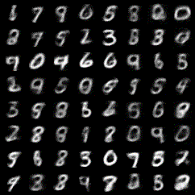

# VAE实现

**Auto-Encoding Variational Bayes**

阅读VAE原文后试着对VAE的实现，使用的框架是pytorch。

其中需要特别注意的是，我遇到了“KL vanishing”问题，即loss中的kl项相对于reconstruction项更加容易优化，导致其被优化到了0。这使得encoder无法将样本的信息写入隐变量，而decoder完全退化为一个概率模型。

这里的解决方案比较简单，在KL loss前乘以一个较小的权重，使得其对参数的影响力减小，以下是我的采样结果：

[博客链接](https://luyiyun.online/2020/05/27/vae2013/)
